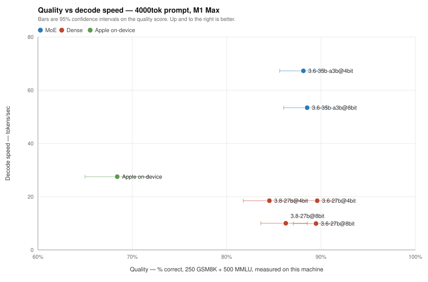

# Qwen and Apple on-device inference on an M1 Max: quality, latency, cost

Mac Studio, Apple M1 Max — 32 GPU cores, 64 GB unified memory (~400 GB/s
theoretical). LM Studio + MLX unless noted; Apple's on-device Foundation Model
via `fm serve` on macOS 27. Quality is measured on this machine against a fixed
750-item set, not taken from published scores. See the [Log](#log) for what was
measured when and where the raw data lives.

## Findings

### The whole picture

Quality against decode speed, at a 4,000-token prompt. Up and to the right is
better; bars are 95% confidence intervals.

| Variant | Quality | GSM8K | MMLU | Decode | TTFT | Answer¹ |
|---|---|---|---|---|---|---|
| `35b-a3b@4bit` (MoE) | 88.1% | 96.8% | 83.8% | **67.3** | **5.7 s** | **13.1 s** |
| `35b-a3b@8bit` (MoE) | 88.5% | 96.0% | 84.8% | 53.4 | 5.7 s | 15.1 s |
| Apple on-device | 68.4% | 80.8% | 62.2% | 27.5 | 5.8 s | 24.0 s |
| `3.6-27b@4bit` | **89.6%** | 96.4% | **86.2%** | 18.5 | 36.6 s | 63.7 s |
| `3.8-27b@4bit` | 84.5% | 96.0% | 78.8% | 18.5 | 37.1 s | 64.1 s |
| `3.6-27b@8bit` | 89.5% | 96.8% | 85.8% | 9.9 | 36.6 s | 87.1 s |
| `3.8-27b@8bit` | 86.3% | 96.0% | 81.4% | 10.0 | 36.6 s | 86.6 s |

¹ Time to a finished 500-token answer: `ttft + 500/decode`. Normalised rather
than measured directly, because the models do not agree on when to stop — see
[Caveats](#caveats).

**`35b-a3b@4bit` wins on every axis that matters.** It is within 1.5 points of
the best quality score on the board while being 3.6× faster to decode and 6.4×
faster to first token. The only variant that beats it on quality, `3.6-27b@4bit`,
takes **63.7 s to produce an answer where the MoE takes 13.1 s** — and buys 1.5
points of composite for that, which is inside the confidence interval.

### 8-bit buys nothing

Three models, each built at both precisions, 500 MMLU items apiece:

| Model | 4-bit MMLU | 8-bit MMLU | Δ |
|---|---|---|---|
| `3.6-27b` | 86.2% | 85.8% | −0.4 |
| `3.6-35b-a3b` | 83.8% | 84.8% | +1.0 |
| `3.8-27b` | 78.8% | 81.4% | +2.6 |

Pooled across all three — 1,500 items per precision — 8-bit scores **+1.07
points, against a standard error of 1.36.** That is 0.79σ: not distinguishable
from zero. No individual pair reaches significance either, and one goes the
wrong way.

What 8-bit reliably costs is speed: **1.26× slower decode on the MoE, 1.87× on
the dense builds**, with prefill and time-to-first-token unchanged to within a
percent. It also doubles the disk and memory footprint.

An earlier version of this report said the 4-bit/8-bit choice "cannot be settled
on these numbers alone" because the two cost nearly the same energy. It can now
be settled on quality, and the answer is that **there is no measurable quality
reason to prefer 8-bit on this machine.**

### GSM8K is saturated; MMLU is the only axis that discriminates

Every Qwen build scores **96.0–96.8%** on GSM8K — a 0.8-point spread across six
variants spanning two model generations, two architectures and two precisions.
The task cannot tell them apart.

MMLU spreads them over 7.4 points, and every conclusion about relative quality
in this report rests on it. A benchmark that reported only GSM8K would conclude
all six builds are identical.

This was nearly missed. At a 512-token generation cap the same six builds
appeared to range 91.2–94.4%, and the differences tracked **how often a model
ran past the cap** rather than whether it got the answer right: truncated items
graded 0–22% correct, untruncated ones 98%. Raising the cap to 1,536 and
re-grading only the truncated items moved `3.8-27b@4bit` by 4.8 points and
collapsed the apparent spread. The metric had been ranking verbosity.

### Qwen3.8-27B is a quality regression on this machine

At matched parameter count, precision, runtime and prompt:

| | `3.6-27b` | `3.8-27b` | Δ |
|---|---|---|---|
| MMLU @ 4-bit | 86.2% | 78.8% | **−7.4** |
| MMLU @ 8-bit | 85.8% | 81.4% | **−4.4** |
| Composite @ 4-bit | 89.6% | 84.5% | −5.1 |
| GSM8K (either) | 96.4–96.8% | 96.0% | ~0 |

The 4-bit gap is ~3.1 standard errors (p≈0.002). It holds at both precisions and
survives the truncation fix, and MMLU answers are two tokens long so no
generation-length artefact can explain it. Decode and prefill are identical
between the two generations to within 1%.

**This does not contradict the earlier "3.8 matches 3.6" finding — it qualifies
it.** That was a statement about decode speed, and it still holds exactly. It
was never a statement about quality, and read as a general endorsement it would
be wrong: on knowledge recall the newer generation is meaningfully behind here.

### Apple's on-device model is a different point on the curve, not a worse Qwen

`fm` scores **68.4%** composite against 84.5–89.6% for the Qwen builds — roughly
20 points back, and the gap is wider on knowledge (62.2% MMLU) than on reasoning
(80.8% GSM8K). Its weakest subjects are what you would expect of a small model:
`global_facts` 12.5%, `abstract_algebra` 22.2%, `college_physics` 25.0%.

But it is not slow, and it is not big:

- **27.5 tok/s decode at a 4k prompt**, 50 tok/s on a short one — between the
  dense 27B builds and the MoE, and it reaches first token in 5.8 s where the
  dense builds need 36.6 s.
- **No model to download, load or hold resident.** The dense builds occupy
  16–37 GB of unified memory; `fm` is already there.
- **A 4,096-token context**, which rules it out for long-document work entirely.

For short prompts where the answer does not hinge on recall, it is the cheapest
thing on the machine by a wide margin. For anything needing breadth of knowledge
or more than ~3k tokens of context, it is not a candidate.

### Architecture beats every other lever

At a 4,000-token prompt, MoE 4-bit against the best dense build:

| | Dense `3.6-27b@4bit` | MoE `35b-a3b@4bit` | ratio |
|---|---|---|---|
| Decode | 18.5 tok/s | 67.3 tok/s | **3.6×** |
| Prefill | 89 tok/s | 572 tok/s | **6.4×** |
| TTFT | 36.6 s | 5.7 s | **6.4×** |
| Answer (500 tok) | 63.7 s | 13.1 s | **4.9×** |
| Quality | 89.6% | 88.1% | 0.98× |

Activating ~3B of 35B parameters means less work per token, not merely less
waiting on memory, so the gain shows up in prefill (compute-bound) as strongly
as in decode (memory-bound). Quantization, by contrast, only ever moves decode.

The 1.5-point quality difference is inside the interval. The 4.9× latency
difference is not.

### Power, briefly

Measured 2026-08-03 with `powermetrics`, and unchanged by this round's work.
Two results, both still standing:

- **Quantization is energy-neutral.** Going to 4-bit makes decode substantially
  faster, but power rises almost in proportion, so watt-hours per token barely
  move (0.99× dense, 1.07× MoE). Choosing a precision costs latency, not
  electricity.
- **Architecture is where the efficiency is.** MoE 4-bit against dense 4-bit:
  2920 vs 418 tokens/Wh, a **7×** gap — double the throughput gain, because the
  MoE is faster *and* draws less (37.0 W vs 46.4 W).

Power draw also scales with prompt length (MoE 4-bit: 23.7 W → 44.3 W from the
shortest prompt to the longest); idle baseline was 1.9–3.2 W.

None of this changes a decision. The energy differences either vanish
(quantization) or point the same way as the latency differences (architecture),
so the practical advice is identical whether or not you care about watts.

### Disk location is a non-issue

Measured 2026-08-19, `qwen3.8-27b` MLX 4-bit (14.98 GiB), internal NVMe
(6.60 GB/s) vs a USB SSD (3.46 GB/s):

| Location | Cold load | Decode | Prefill | TTFT |
|---|---|---|---|---|
| Internal | 18.4 s | 18.4 tok/s | 88 | 29.68 s |
| `ext1` | 24 s | 18.5 tok/s | 89 | 29.10 s |

Once loaded the disk is irrelevant — weights live in unified memory and every
inference metric is identical within noise. Cold load is 1.3× slower, not the
1.9× the raw disk gap suggests, because loading is mostly MLX setup and GPU
upload rather than I/O: internal cold (18.4 s) and internal *warm* (18.1 s)
differ by 0.3 s, so the read is ~2% of the total. Practical cost: **~6 s per
cold load, once per model per session.**

## Practical takeaways

- **`35b-a3b@4bit` is the default, and the case is now much stronger.** It was
  already the fastest and most energy-efficient; it is also within 1.5 points of
  the best quality measured, which is inside the noise. Nothing on this machine
  beats it on the combination.
- **Do not use 8-bit.** It buys +1.07 MMLU points at 0.79σ — indistinguishable
  from zero — and costs 1.26–1.87× decode speed plus double the footprint. The
  earlier "8-bit is nearly free in energy terms" is true and no longer relevant:
  it is free in energy and expensive in time, for nothing.
- **Prefer 3.6 over 3.8 at 27B.** Same speed, 4.4–7.4 points worse on MMLU.
- **The dense builds are hard to justify.** `3.6-27b@4bit` has the best quality
  score on the board, but it is a 1.5-point edge inside the interval, paid for
  with 6.4× the time to first token. Reach for it only when that 1.5 points is
  worth a minute of waiting.
- **Apple's `fm` is worth reaching for on short prompts.** Nothing to load,
  nothing resident, first token in under a second on a short prompt. Not for
  knowledge-heavy work, and useless past ~3k tokens of context.
- **Keep models on whatever disk is convenient.** Costs ~6 s per cold load and
  nothing thereafter.

## Methodology notes

- **Quality is measured here, not cited.** 250 GSM8K items (numeric answer) and
  500 MMLU items (4-way multiple choice, sampled evenly across all 57 subjects),
  drawn once with a fixed seed into `quality/items.jsonl`. Published scores
  describe a model at full precision on someone else's hardware; these are the
  4- and 8-bit MLX builds actually serving localhost.
- **Reasoning mode is off.** Qwen3.x thinks by default, which costs 300+ tokens
  on a multiple-choice item, makes the run ~10× longer, and makes comparison
  against Apple's non-reasoning model meaningless. LM Studio honours neither
  `/no_think` nor `chat_template_kwargs`, but does honour an assistant prefill
  of an empty `<think></think>` block. Scores in this report are all no-think
  and are not comparable to reasoning-mode scores.
- **Percentages carry Wilson intervals**, which behave at the boundaries where
  the normal approximation does not. At 750 items that is roughly ±3 points, so
  differences smaller than that are not differences.
- **Latency is measured at the socket** as well as read from the server's
  counters, because `fm serve` reports no token usage at all and only a
  client-side clock means the same thing for both backends.
- **KV cache is defeated per run.** LM Studio reuses cached prefixes across
  requests — an identical repeated prompt prefills 11.6× faster — so every
  prompt body is seeded from a per-run nonce.
- **Warm-up runs until the rate stops climbing**, against a token budget rather
  than a request count. See the caveat below.
- Energy is attributed from a `powermetrics` log with a 10 s guard band, using
  the 25th percentile of out-of-window samples as the idle floor rather than the
  mean, because model loading falls in those gaps.

### Five ways this benchmark quietly lied

Every one of these produced a plausible wrong number rather than an error, and
each is now guarded:

1. **LM Studio serves a different model than you asked for.** Request a variant
   that is not on disk — `qwen3.8-27b@q4_k_m`, since that GGUF build was
   deleted — and it answers with whichever model happens to be resident,
   reporting that model's id and nothing else to mark the substitution. Both
   tools now check the served id against the requested one.
2. **Streamed responses carry no token counts** unless `stream_options:
   {include_usage: true}` is passed, and reasoning models stream their output as
   `reasoning_content` rather than `content`. Together these produced a
   throughput matrix in which every Qwen row was silently empty.
3. **A generation cap measures verbosity.** At 512 tokens, GSM8K scores tracked
   truncation rate rather than correctness (see above).
4. **One warm-up run is not enough for a large model.** Warm-up was counting
   requests, but the ramp is measured in generated tokens: the 37.75 GB MoE
   reported 7.7 tok/s after three stable-looking runs and 52 tok/s once actually
   warm. It now warms against a 24,000-token budget and reports when the budget
   ran out while the rate was still climbing.
5. **A prompt that lets one model stop early.** "Reply with a single short
   sentence" produced 255 tokens from Qwen (which ignored it) and 15 from Apple's
   model (which obeyed), so decode rate was being compared over a 24-second
   window against a 0.17-second one. The prompt now demands a long answer.

`fm serve` adds two of its own: it **overflows its 4,096-token context
silently** (HTTP 200, well-formed, entirely empty — measured boundary 3,765
tokens fine, 4,376 nothing), and it **ignores `max_tokens`**.

## Caveats

- **Quality here is two tasks, not a general claim.** GSM8K and MMLU say nothing
  about code, long-context work, instruction-following, or writing quality. A
  model that is 7 points better on MMLU is better at MMLU.
- **GSM8K no longer discriminates** between these builds at all, so the
  composite score is mostly MMLU wearing a disguise. Read the MMLU column.
- **"Time to a finished answer" is normalised, not measured.** The models do not
  agree on when to stop — Qwen runs to the 256-token cap, `fm` ignores the cap
  and wrote 1,026–1,492 tokens — so raw totals are not comparable. The figure is
  `ttft + 500/decode`, which is honest about the rate but assumes a fixed answer
  length.
- **Prompts of the same nominal size are not the same size in tokens across
  backends**, because the builder sizes by characters and the tokenizers differ:
  the "4000tok" row is 3,241 tokens for Qwen and 2,705 for `fm`. Rate metrics
  are unaffected; raw TTFT across backends carries this caveat.
- **An unexplained 5× slowdown was observed and not root-caused.** Between
  benchmark runs, the 37.75 GB MoE measured 8–12 tok/s on repeated clean loads,
  against 41.9 tok/s earlier the same day and 53.4 tok/s in the final controlled
  matrix. Free memory was near zero and compressed memory had grown from 2.7 GB
  to 11.8 GB over the session, but swap and compressor deltas were flat during
  the slow runs, so memory pressure is suspected and unproven. Every throughput
  row now records free memory either side of its timing; on healthy runs that
  figure is also near zero, so it does not discriminate. The matrix numbers were
  taken under controlled conditions and match historical measurements, but this
  is a known unexplained instability on this machine.
- **Power is SoC package only** (CPU + GPU + ANE) — excludes DRAM, PSU losses,
  and the rest of the machine. Treat it as a floor on wall draw.
- `qwen3.8-27b@q4_k_m` (llama.cpp GGUF) is **no longer on disk** and could not
  be re-measured. Its 2026-08-14 numbers survive in the Log only.
- The disk experiment's cold-load figures are a single measurement per location,
  and it ran with another workload sharing the LM Studio server.

## What this cost

Energy was measured only for the 2026-08-03 matrix: **21.2 Wh above idle**, or
about **$0.007** at $0.32/kWh — two-thirds of a cent, 87% of it the two dense
variants. The larger cost of this round was time, not electricity: roughly 20
machine-hours of grading and timing.

An earlier version of this report estimated energy from assumed wall draw (85 W)
and put a comparable workload near 60 Wh. The measurement came in **2.7× lower**.
The assumption was wrong twice over: sustained draw is far below peak, and on a
machine left powered on all day the relevant quantity is the increment over
idle, not total draw.

## Log

### 2026-08-03 — Qwen3.6 MoE vs dense, full matrix

Compared `qwen3.6-35b-a3b` (MoE, ~3B active) against `qwen3.6-27b` (dense) at
4-bit and 8-bit, across four prompt lengths (30 to 12,853 tokens), measuring
decode/prefill throughput and power via `powermetrics`. Raw data in
`results/2026-08-03/`.

Learned: architecture (MoE vs dense) drives a 7× energy-per-token difference,
while quantization (4-bit vs 8-bit) is roughly energy-neutral and only trades
latency. Power draw scales with prompt length in every variant. MoE 4-bit is
the clear default.

### 2026-08-14 — Addendum: Qwen3.8-27B (GGUF Q4_K_M), throughput only

Benchmarked `qwen/qwen3.8-27b` as a llama.cpp GGUF build, same machine and
settings as above, but no power sampler running. Raw data in
`results/2026-08-14/`.

Learned: decode looked ~45% slower and prefill ~35% faster than the MLX 4-bit
dense 3.6 build. At the time this read as a model-generation regression on
decode. It was later shown (2026-08-19) to be a runtime artifact — GGUF vs
MLX — not a property of Qwen3.8 itself.

### 2026-08-19 — Internal vs external (USB) disk for model storage

Measured cold/warm load time and inference throughput for `qwen/qwen3.8-27b`
MLX 4-bit from internal NVMe vs a USB-attached SSD (`ext1`, 3.46 GB/s
sequential). Raw data and full write-up in `results/2026-08-19/external-disk.md`.

Learned two things: (1) disk location is irrelevant to inference once a model
is loaded, and costs only ~6 s extra on cold load with this disk (sub-linear
vs the 1.9× raw throughput gap, because loading is mostly MLX setup/GPU
upload, not I/O); (2) as a side effect of using an MLX build of 3.8-27b for
this test, resolved the 2026-08-14 addendum's apparent decode regression —
it was the GGUF runtime, not the model.

### 2026-09-14 — Quality, latency, and Apple's on-device model

The first round with a quality axis. Built `quality-bench` (250 GSM8K + 500
MMLU, fixed seed, auto-graded, Wilson intervals) and graded all six Qwen
variants — three models × two precisions — plus Apple's on-device Foundation
Model via `fm serve` on macOS 27. Re-ran the throughput matrix with client-side
latency so the two backends could be compared on one clock. Raw data in
`results/2026-09-14/`.

Learned: 8-bit buys no measurable quality (+1.07 MMLU points pooled over 1,500
items per precision, 0.79σ) while costing 1.26–1.87× decode — so the
4-bit/8-bit question the 2026-08-03 round left open is now closed. GSM8K is
saturated across all six builds and only MMLU discriminates. Qwen3.8-27B is
4.4–7.4 MMLU points behind Qwen3.6-27B at matched size and precision, which
qualifies the 2026-08-19 "3.8 matches 3.6" result as a statement about speed
only. Apple's model is ~20 points behind on quality but decode-competitive with
a 4,096-token context and no memory footprint.

Also learned how many ways a benchmark can report a confident wrong number —
five distinct silent failures, listed under Methodology. The most expensive was
a 512-token generation cap that made the scores rank verbosity instead of
correctness.
